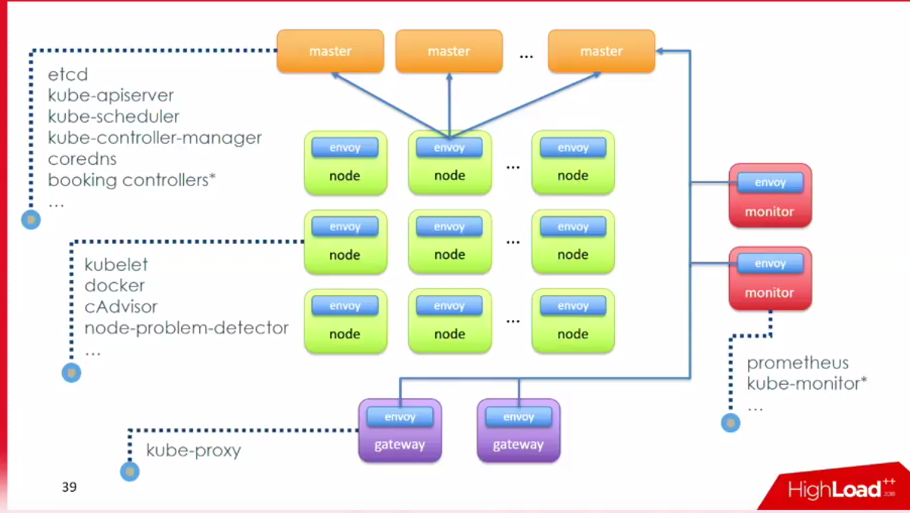

# Тернии контейнеризированных приложений и микросервисов

Иван Круглов, Booking.com

<!-- START doctoc generated TOC please keep comment here to allow auto update -->
<!-- DON'T EDIT THIS SECTION, INSTEAD RE-RUN doctoc TO UPDATE -->

- [Проблема](#%D0%BF%D1%80%D0%BE%D0%B1%D0%BB%D0%B5%D0%BC%D0%B0)
- [Первые попытки решения](#%D0%BF%D0%B5%D1%80%D0%B2%D1%8B%D0%B5-%D0%BF%D0%BE%D0%BF%D1%8B%D1%82%D0%BA%D0%B8-%D1%80%D0%B5%D1%88%D0%B5%D0%BD%D0%B8%D1%8F)
  - [Marathon](#marathon)
  - [Openshift](#openshift)
  - [Результат двух первых попыток внедрения](#%D1%80%D0%B5%D0%B7%D1%83%D0%BB%D1%8C%D1%82%D0%B0%D1%82-%D0%B4%D0%B2%D1%83%D1%85-%D0%BF%D0%B5%D1%80%D0%B2%D1%8B%D1%85-%D0%BF%D0%BE%D0%BF%D1%8B%D1%82%D0%BE%D0%BA-%D0%B2%D0%BD%D0%B5%D0%B4%D1%80%D0%B5%D0%BD%D0%B8%D1%8F)
  - [План!](#%D0%BF%D0%BB%D0%B0%D0%BD)
- [kubernetes](#kubernetes)
  - [Directly Routable Pods](#directly-routable-pods)
  - [Тестирование](#%D1%82%D0%B5%D1%81%D1%82%D0%B8%D1%80%D0%BE%D0%B2%D0%B0%D0%BD%D0%B8%D0%B5)
- [Результаты и достижения](#%D1%80%D0%B5%D0%B7%D1%83%D0%BB%D1%8C%D1%82%D0%B0%D1%82%D1%8B-%D0%B8-%D0%B4%D0%BE%D1%81%D1%82%D0%B8%D0%B6%D0%B5%D0%BD%D0%B8%D1%8F)
- [Заключение:](#%D0%B7%D0%B0%D0%BA%D0%BB%D1%8E%D1%87%D0%B5%D0%BD%D0%B8%D0%B5)

<!-- END doctoc generated TOC please keep comment here to allow auto update -->

1500 человек, 30 000 серверов.

Состав:

* ServerDB
* Puppet
* Perl & Java
* MySQL
* storage
* service discovery (Zookeeper)
* data streaming (Kafka + in-house)
* data aggregation
* graphite, переписанный на Go
* alerts/predictions (in-house)

# Проблема

Бизнес хочет ускорить time to market.

Есть роли серверов — server role. Новый продукт — новая роль. Надо писать puppet, открывать доступы и порты, конфигурировать-конфигурировать-конфигурироовать. ВРУЧНУЮ.

Это умеет горстка людей — это узкое звено. Они делают это дни или недели, это тоже.

Хотим: доступно всем, работает за минуты. Для решения стали строить PaaS. 

# Первые попытки решения

Пробовали:

* marathon
* openshift
* k8s

Первые две платформы профакапили, последнюю наполовину. О том и речь в докладе.

## Marathon

Начался как хакатон, но так и не закончился. Не хватило фич.

Мысль 1: не стоит недооценивать способность кода выживать.

## Openshift

Случилась эйфория:

* Там же k8s, а его разработал Google
* Там же есть Ansible, а это круто.
* И ещё Open vSwitch, который должен был порешать все проблемы.

Раз фичи есть, хотелось их использовать, просто потому что они клёвые. А потом эйфория закончилась. Началось непонятное поведение системы.

А ещё не было нормального мониторинга, алертов и лимитов. Разработчик опечатался и заиспользовал 100500 ресурсов платформы.

Мысль 2: Cool vs. boring. Три крупных сложных системы вместе — круто, но нереально. Лучше скучно, но работает, чем интересно, но не работает.

### Проблема с деплоем

От платформы хотели простой и удобный интерфейс. Как Heroku. 

В результате: пользователей научили нажимать кнопку, а внутренности скрыли. При проблемах нужно идти и дебажить людям их приложения. Нет времени на развитие платформы.

Мысль 3: стоит сформулировать ожидание пользователей от системы и системы от пользователей.

Пользователям нужны хотя бы базовые знания о том, как платформа устроена внутри.

### Проблема с интеграциями

Новые приложения должны работать со старой системой.

Точки интеграции:

* DLB (distributed load balancing)
* service discovery
* events
* storage
* DB: MySQL, Cassandra, Redis, Kafka
* SSL certivicates, identity key management
* Secrets

Секреты в k8s:

* Не шифруются в etcd (появилось в 1.7 alpha)
* Есть Vault, который пришлось форкнуть и дописывать. Сложный, но безопасный workflow.

Мысль 4: k8s — клёво, но его интеграция в существующую экосистему компании важнее.

## Результат двух первых попыток внедрения

* Устали
* Задолбались
* Потеряли доверие пользователей
* Но был план!

## План!

* Минимум клёвых штук. Отказ от Ansible и Open vSwitch.
* Мониторинг инфраструктуры. Сами сообщаем, что у нас проблемы.
* Выстроили чёткие ожидания внутри команды, между командой и пользователями:

  > Если вы хотите использовать платформу, вы должны 1) иметь базовые знания о k8s, 2) обеспечить свой сервис поддержкой.
  
  и ещё ожидания с провайдерами интеграций.
* Инвестиции в знания.

    * тренинги
    * онлайн-курсы
    * книги
    * документация

С этими идеями пришли к третьему шагу: внедрять чистый k8s.

# kubernetes

(Пока что) не профакапленная платформа.

Сделали несколько кластеров — застраховались сами от себя. Если положат один, то только один, а не всю систему.

Архитектура:

## Directly Routable Pods

Цель — плоская и простая сеть. Каждой ноде назначен /27, маленькая подсеть. Каждый под получает адрес, как любой физический сервер — `10.*`. Между подами и другими хостами во внутренней сети — прямой доступ. Поэтому не нужен ingress.

Поощряем использование Pod IP-адреса. Экспортируем в Service Discovery и почти в DLB.

    service.namespace.svc.cluster.local
    
    service.namespace.svc.eu-nl-prod-a.booking.com

## Тестирование

kube-probe — функциональное тестирование для k8s. Проверяет способность кластера выполнять:

* базовые функции
* сетевое соединение
* интеграции

# Результаты и достижения

* Есть стабильная система
* ~200 уникальных сервисов, количество растёт
* Понимаем происходящее
* Отладили взаимодействие
* Вся система самообслуживается
* Выстроили отлаженную систему обучения

# Заключение:

* Управление ожиданиями — ключ к успеху.
* k8s хорош, но интеграция важнее.
* k8s — это экосистема, он требует понимания даже со стороны пользователей.
* важно вкладываться в обучение.
