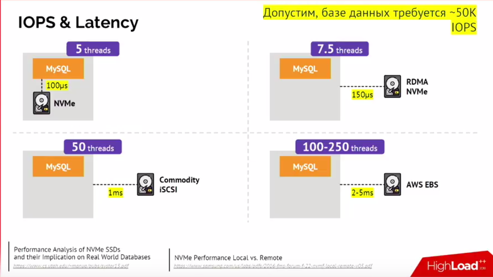

 <a href = "https://t.me/docops">docops</a>

# Базы данных и Kubernetes

Дмитрий Столяров, Флант

<!-- START doctoc generated TOC please keep comment here to allow auto update -->
<!-- DON'T EDIT THIS SECTION, INSTEAD RE-RUN doctoc TO UPDATE -->

- [Философия высокой доступности в k8s](#%D1%84%D0%B8%D0%BB%D0%BE%D1%81%D0%BE%D1%84%D0%B8%D1%8F-%D0%B2%D1%8B%D1%81%D0%BE%D0%BA%D0%BE%D0%B9-%D0%B4%D0%BE%D1%81%D1%82%D1%83%D0%BF%D0%BD%D0%BE%D1%81%D1%82%D0%B8-%D0%B2-k8s)
- [Гарантии согласованности в k8s](#%D0%B3%D0%B0%D1%80%D0%B0%D0%BD%D1%82%D0%B8%D0%B8-%D1%81%D0%BE%D0%B3%D0%BB%D0%B0%D1%81%D0%BE%D0%B2%D0%B0%D0%BD%D0%BD%D0%BE%D1%81%D1%82%D0%B8-%D0%B2-k8s)
  - [Consistent Switchover](#consistent-switchover)
- [Хранение данных и k8s](#%D1%85%D1%80%D0%B0%D0%BD%D0%B5%D0%BD%D0%B8%D0%B5-%D0%B4%D0%B0%D0%BD%D0%BD%D1%8B%D1%85-%D0%B8-k8s)
- [Кейсы](#%D0%BA%D0%B5%D0%B9%D1%81%D1%8B)
  - [Кейс 1: Standalone](#%D0%BA%D0%B5%D0%B9%D1%81-1-standalone)
  - [Кейс 2: Реплицированная пара с ручным переключением](#%D0%BA%D0%B5%D0%B9%D1%81-2-%D1%80%D0%B5%D0%BF%D0%BB%D0%B8%D1%86%D0%B8%D1%80%D0%BE%D0%B2%D0%B0%D0%BD%D0%BD%D0%B0%D1%8F-%D0%BF%D0%B0%D1%80%D0%B0-%D1%81-%D1%80%D1%83%D1%87%D0%BD%D1%8B%D0%BC-%D0%BF%D0%B5%D1%80%D0%B5%D0%BA%D0%BB%D1%8E%D1%87%D0%B5%D0%BD%D0%B8%D0%B5%D0%BC)
  - [Кейс 3. Масштабирование нагрузки на чтение](#%D0%BA%D0%B5%D0%B9%D1%81-3-%D0%BC%D0%B0%D1%81%D1%88%D1%82%D0%B0%D0%B1%D0%B8%D1%80%D0%BE%D0%B2%D0%B0%D0%BD%D0%B8%D0%B5-%D0%BD%D0%B0%D0%B3%D1%80%D1%83%D0%B7%D0%BA%D0%B8-%D0%BD%D0%B0-%D1%87%D1%82%D0%B5%D0%BD%D0%B8%D0%B5)
  - [Кейс 4. Умный клиент](#%D0%BA%D0%B5%D0%B9%D1%81-4-%D1%83%D0%BC%D0%BD%D1%8B%D0%B9-%D0%BA%D0%BB%D0%B8%D0%B5%D0%BD%D1%82)
  - [Кейс 5. Cloud native решения](#%D0%BA%D0%B5%D0%B9%D1%81-5-cloud-native-%D1%80%D0%B5%D1%88%D0%B5%D0%BD%D0%B8%D1%8F)
  - [Кейс 6. Stolon PostgreSQL](#%D0%BA%D0%B5%D0%B9%D1%81-6-stolon-postgresql)
- [Выводы](#%D0%B2%D1%8B%D0%B2%D0%BE%D0%B4%D1%8B)

<!-- END doctoc generated TOC please keep comment here to allow auto update -->

Вопрос:

* А можно ли базу в k8s?
* А можно ли вообще stateful в k8s?

А зачем нам вообще это? Потому что k8s — это <strike> клёво</strike>, удобно.

Что именно stateful?

* relational database
* nosql database
* in-memory database
* message queue
* search engine
* object storage
* configuration & service discovery

Тема доклада:

1. Философия высокой доступности в k8s
1. Гарантии согласованности в k8s
1. Хранение данных и k8s

# Философия высокой доступности в k8s

Питомцы или стадо? (Pets vs. cattle)

Раньше: два сервера-питомца. Мы их со всех сторон охраняем, чтобы не упали.

Теперь: загончик из pod'ов и стадо контейнеров. Сдох — заменим.

Механизмы HA^

* Deployment, StatefulSet
* PodAntiAffinity
* PodDisruptionBudget — сколько максимум подов можно погасить.

# Гарантии согласованности в k8s

At-most-once guarantee. Запрос обрабатывает не более чем один узел.

Предположим, у нас нарушение связности.

Как раньше: узел отвалился, снаружи неясно, совсем он умер иил просто недоступен. Применяем fencing — пытаемся выключить/убить сервис. Когда удостоверились, только тогда другой узел может стать мастером и принимать соединения от клиентов. Тогда клиенту точно не ответят два.

В кубе есть два контроллера: Deployment и StatefulSet. В первом он сразу пересоздаёт контейнер. Во втором ждёт точных результатов. Но всё ещё нужен fencing. Его из коробки нет, но сделать можно.

## Consistent Switchover

Как обойтись без fencing? Пусть у нас есть хитрый load balancer. Он может атомарно выключить весь трафик на один узел. Если узел упал, мы говорим LB выключить трафик на тот узел, дожидаемся реплики базы, включаем трафик на себя. Простой есть, но гораздо меньше. Называется «Consistent Switchover».

А где это в k8s? Расскажут позже.

# Хранение данных и k8s

k8s монтирует сетевой диск на ноду и так передаёт её контейнеру. Если контейнер выключается, диск перемонтируется и передаётся.

Сразу проблема: у диска есть латенси. Чем больше латенси, тем больше нужно потоков, чтобы выдержать заданный IOPS (input-output operations per second).

Итог

* C ReadWriteOnce всё отлично.
* Старайтесь избегать Network File System.

# Кейсы

## Кейс 1: Standalone

Есть множество случаев, когда HA не нужна.

* Тестовые и стейджинги
* Бывают некритичные микросервисы: 15 минут полежит и встанет, и нормально.

Как на виртуалке, но мы же любим когда всё в k8s.

## Кейс 2: Реплицированная пара с ручным переключением

Два инстанса. Вручную включаем и выключаем трафик, когда нам это нужно. Эквивалент двух виртуалок с ручным переключением.

## Кейс 3. Масштабирование нагрузки на чтение

Да, это не совсем про стейтфул. Но можно. Когда нагрузка выросла — добавили инстансов, ушла — убрали.

## Кейс 4. Умный клиент

Вместо балансирования запросов, выдаём всем узлам разные домены. Некоторые клиенты сами умеют в шардинг-репликацию.

## Кейс 5. Cloud native решения

Сами умеют:

* failover
* recovery
* consistency

Ставятся в StatefulSet и всё сами умеют.

Как узнают друг о друге? 

* K8s API
* DNS (несколько А-записей)
* Статически
* Seed-узлы, которые друг друга сами помнят уже
* Сторонний service discovery

Как подключается клиент? Есть поддержка из коробки.

Горизонтальное масштабирование? Может быть или не быть, зависит от продукта.

Суть: все cloud native решения хорошо работают с k8s, потому что их делали сразу в расчёте на режим cattle.

## Кейс 6. Stolon PostgreSQL

PostgreSQL cloud native high availability.

Stolon помогает перейти от питомцев к стаду.

* keeper автоматически конфигурирует инстансы
* sentinel следит за конфигурацией кластера и решает, кто будет мастером или стендбаем
* proxy реализует consistent switchover

# Выводы

Технологии развиваются волнами. Сначала технология появляется, потом она становится простой. Пока что стейтфул в k8s — уже можно, но ещё сложно, но со временем станет проще и лучше.

Компания Flant делает инструмент https://github.com/flant/dapp. 
